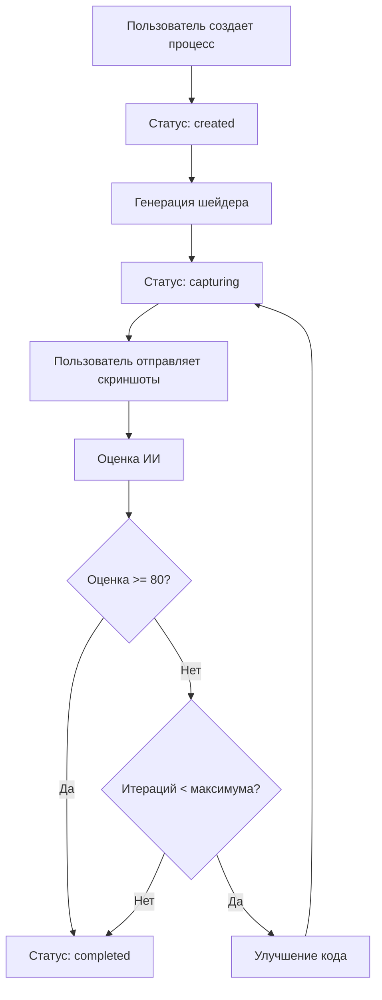

# 🏗️ Shader Maker - Process-Based Architecture

## Обзор

Система переработана для запуска процессов разработки шейдеров на бэкенде с полным сохранением состояния в базе данных. Это обеспечивает надежность, масштабируемость и возможность восстанавливать процессы после перезапуска сервера.

## 🗃️ База данных

### Таблицы

#### `shader_processes`
Основная таблица процессов:
```sql
CREATE TABLE shader_processes (
  id TEXT PRIMARY KEY,
  prompt TEXT NOT NULL,
  status TEXT NOT NULL,
  current_step TEXT,
  config TEXT NOT NULL,
  result TEXT,
  created_at TIMESTAMP DEFAULT CURRENT_TIMESTAMP,
  updated_at TIMESTAMP DEFAULT CURRENT_TIMESTAMP,
  completed_at TIMESTAMP
);
```

#### `process_steps`
Шаги процесса:
```sql
CREATE TABLE process_steps (
  id TEXT PRIMARY KEY,
  process_id TEXT NOT NULL,
  type TEXT NOT NULL,
  status TEXT NOT NULL,
  input TEXT,
  output TEXT,
  error TEXT,
  started_at TIMESTAMP DEFAULT CURRENT_TIMESTAMP,
  completed_at TIMESTAMP,
  duration INTEGER,
  FOREIGN KEY (process_id) REFERENCES shader_processes (id)
);
```

#### `process_updates`
Обновления для real-time уведомлений:
```sql
CREATE TABLE process_updates (
  id INTEGER PRIMARY KEY AUTOINCREMENT,
  process_id TEXT NOT NULL,
  status TEXT NOT NULL,
  current_step TEXT,
  step_progress TEXT,
  new_step_id TEXT,
  result TEXT,
  error TEXT,
  created_at TIMESTAMP DEFAULT CURRENT_TIMESTAMP,
  FOREIGN KEY (process_id) REFERENCES shader_processes (id)
);
```

## 🔄 Жизненный цикл процесса

### Статусы процесса
- `created` - Процесс создан
- `generating` - Генерация шейдера
- `capturing` - Ожидание скриншотов
- `evaluating` - Оценка результата
- `improving` - Улучшение кода
- `fixing` - Исправление ошибок
- `completed` - Завершен
- `failed` - Ошибка
- `paused` - Приостановлен

### Типы шагов
- `generation` - Генерация шейдера по промпту
- `capture` - Захват скриншотов
- `evaluation` - Оценка качества ИИ
- `improvement` - Улучшение кода
- `fix` - Исправление ошибок компиляции
- `completion` - Финальный шаг

### Поток выполнения



## 🚀 API Эндпоинты

### Управление процессами

#### `POST /api/processes/start`
Запуск нового процесса
```typescript
{
  prompt: string;
  config?: {
    maxIterations?: number;
    targetScore?: number;
    autoMode?: boolean;
  };
}
```

#### `GET /api/processes/{id}`
Получение статуса процесса
```typescript
// Response
{
  process: ShaderProcess;
  updates: ProcessUpdate[];
}
```

#### `POST /api/processes/{id}`
Управление процессом
```typescript
{
  action: 'pause' | 'resume' | 'stop' | 'retry';
}
```

#### `POST /api/processes/{id}/screenshots`
Отправка скриншотов
```typescript
{
  stepId: string;
  screenshots: string[];
}
```

#### `DELETE /api/processes/{id}`
Удаление процесса

#### `GET /api/processes`
Список всех процессов

## 🎣 Frontend Hook

### `useProcess(options)`

```typescript
const {
  // Состояние
  process,
  updates,
  isLoading,
  error,
  
  // Действия
  startProcess,
  controlProcess,
  submitScreenshots,
  refreshProcess,
  deleteProcess,
  
  // Хелперы
  getCurrentCode,
  getCurrentStep,
  getLatestScore,
  isWaitingForScreenshots
} = useProcess({
  processId: 'some-id',
  autoRefresh: true,
  refreshInterval: 2000
});
```

## 🔧 ProcessRunner

Основной класс для выполнения процессов на бэкенде:

### Методы

- `startProcess(request)` - Запуск процесса
- `executeProcess(id)` - Выполнение всех шагов
- `submitScreenshots(id, stepId, screenshots)` - Обработка скриншотов
- `pauseProcess(id)` - Приостановка
- `resumeProcess(id)` - Возобновление
- `stopProcess(id)` - Остановка

### Шаги выполнения

1. **Generation Step** - Генерация кода через OpenAI
2. **Capture Step** - Ожидание скриншотов от фронтенда
3. **Evaluation Step** - Анализ результата через OpenAI
4. **Improvement Step** - Улучшение кода (если нужно)
5. **Completion** - Финализация результата

## 🔄 Real-time Updates

Система обновлений работает через polling:

1. Фронтенд периодически запрашивает обновления
2. Передается `since` параметр для получения только новых updates
3. Обновления содержат прогресс, сообщения и новые шаги

## 🎯 Преимущества новой архитектуры

### ✅ Надежность
- Полное состояние в БД
- Восстановление после перезапуска сервера
- Журналирование всех шагов

### ✅ Масштабируемость  
- Процессы выполняются асинхронно
- Поддержка множественных процессов
- Очереди и приоритеты (будущее развитие)

### ✅ Прозрачность
- Детальная история каждого шага
- Real-time статус и прогресс
- Полная трассировка ошибок

### ✅ Гибкость
- Пауза/возобновление процессов
- Ручной и автоматический режимы
- Настраиваемые параметры

### ✅ UX
- Неблокирующий интерфейс
- Показ прогресса в реальном времени
- Возможность управления процессами

## 🔮 Будущие улучшения

### Очереди и планировщик
- Redis для очередей
- Приоритизация процессов
- Балансировка нагрузки

### WebSocket/SSE
- Реальное время без polling
- Мгновенные уведомления
- Лучшая производительность

### Кэширование
- Кэш результатов оценки
- Оптимизация OpenAI запросов
- Ускорение повторных операций

### Метрики и аналитика
- Время выполнения шагов
- Статистика успешности
- A/B тестирование промптов 