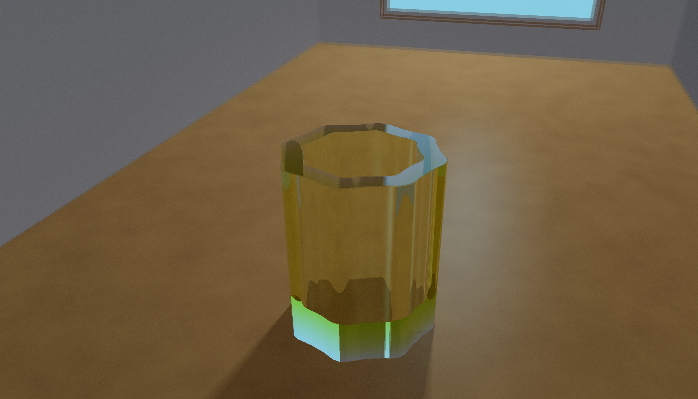
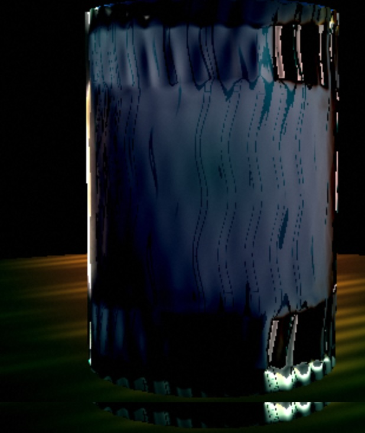
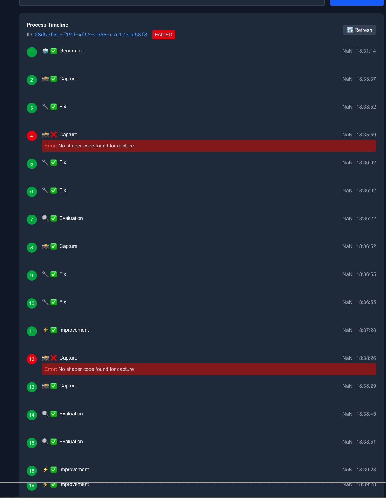
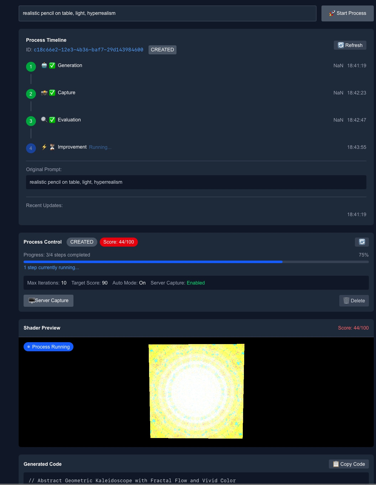

# Shader Maker

AI sucks at writing shaders because it can't see what it creates. This fixes that.





## How it works

Instead of generating shaders blindly, this creates a feedback loop:

1. Generate shader from text description
2. Render it and take screenshots 
3. AI analyzes screenshots and gives feedback
4. Generate improved version
5. Repeat until it looks good





You can watch it work in real-time - pretty satisfying to see the AI actually improve based on visual feedback.

## Setup

```bash
git clone https://github.com/your-username/shader-maker.git
cd shader-maker
npm install
npm run setup
```

Add your OpenAI API key to `.env.local`:
```
OPENAI_KEY=your_api_key_here
```

```bash
npm run dev
```

## Examples

Try prompts like:
- "realistic water droplets on glass"
- "swirling galaxy with stars" 
- "fire effect with realistic flames"
- "geometric mandala pattern"

## Tech Stack

Next.js, Three.js, OpenAI API, SQLite. Pretty standard stuff.

---

Built by Aleksandr Kuznetsov